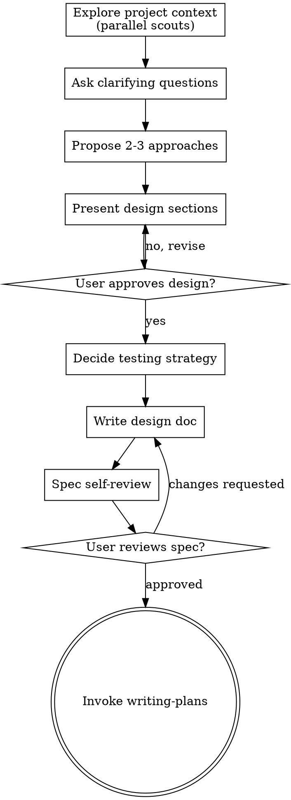

# Brainstorming Ideas Into Designs

Help turn rough ideas into an approved design and a written spec before implementation.

<GATE>
Do not invoke implementation skills, write code, scaffold projects, or make behavior changes until you have presented a design and the user has approved it.
<GATE>

⚠️ HARD GATE: MAX 3 concurrent subagents ⚠️ 

## Checklist

<IMPORTANT>
Create a task for each of these items and complete them in order:

1. **Explore project context** — dispatch parallel `scout` agents with bounded tasks (see `./dispatching-parallel-agents/scout-prompt.md`). Each scout gets: specific files to read, specific questions to answer, a stop boundary, and a conciseness directive. Gather all results before continuing. Never dispatch a scout with a vague mandate like "explore the codebase."
2. **Ask clarifying questions** — one at a time, focused on purpose and constraints
3. **Propose 2-3 approaches** — include trade-offs and a recommendation
4. **Present the design** — scale detail to complexity, get approval section by section
5. **Decide the testing strategy** — identify critical behaviors, manual checks, and whether the work should use TDD or be manually tested
6. **Write the design doc** — save to `~/.know-how/<project-name>/specs/YYYY-MM-DD-<topic>-design.md`
7. **Self-review the spec** — remove ambiguity, placeholders, and contradictions
8. **Ask the user to review the spec** — wait for approval before moving on
9. **Transition to implementation planning** — invoke `know-how:writing-plans`
<IMPORTANT>

## Process Flow

The terminal state is invoking `know-how:writing-plans`.

## The Process

**Understanding the idea:**

- **Explore the current project state first using parallel `scout` agents.** Identify independent read domains (e.g., "the editor module," "the render pipeline," "test coverage") and dispatch one `scout` per domain. Each scout task MUST include: exact files to read, 2-4 specific questions to answer, a stop boundary ("stop after reading listed files"), and a conciseness directive ("bullet list under 500 words"). Use the `subagent` PARALLEL mode with `tasks` array and `concurrency`. See `./dispatching-parallel-agents/scout-prompt.md` for the full template. Never dispatch a scout without these four elements — unbounded scouts burn tokens without producing useful results. Gather all results before drawing conclusions or asking questions.
- If the request covers multiple independent subsystems, decompose it before refining details
- Ask one question per message
- Prefer multiple choice when it makes the trade-off clearer
- Focus on purpose, constraints, and success criteria

**Exploring approaches:**

- Always propose 2-3 approaches
- Lead with your recommendation and explain why
- Surface trade-offs honestly

**Presenting the design:**

- Cover architecture, components, data flow, error handling, and testing
- Keep sections short when the problem is simple
- Ask for approval as you go

**Deciding the testing strategy:**

- Decide whether TDD should be required or manual only
- Identify the highest-risk behavior worth automated coverage
- Call out visual or cosmetic changes that should be verified manually instead
- Avoid designs that imply every UI detail needs an automated assertion

**Working in existing codebases:**

- Follow the existing structure unless it directly blocks the work
- Include targeted cleanup only when it serves the design
- Avoid unrelated refactors

## After the Design

**Documentation:**

- Write the validated spec to `~/.know-how/<project-name>/specs/YYYY-MM-DD-<topic>-design.md`
- Derive `<project-name>` from the current workspace basename and sanitize it for filesystem safety
- If `~/.know-how/<project-name>/` does not exist, create it.
- User preferences for spec location override this default
- Include a short testing strategy section so planning starts from an explicit decision

**Spec Self-Review:**

1. Placeholder scan: remove `TBD`, `TODO`, and vague requirements
2. Internal consistency: ensure sections do not contradict each other
3. Scope check: confirm the scope can be executed as one coherent plan without mixing unrelated subsystems or independent deliverables
4. Ambiguity check: make edge-case behavior explicit for any case that changes user-visible behavior, validation, failure handling, or state transitions

Fix self-review issues inline. If a fix changes the design materially, present the updated spec to the user before planning.

**User Review Gate:**

After the self-review passes, ask the user to review the written spec before planning.

> "Spec written to `<path>`. Please review it and let me know if you want any changes before we write the implementation plan."

Wait for approval before invoking the next skill.

## Key Principles

- One question at a time
- Multiple choice preferred when useful
- YAGNI aggressively
- Explore alternatives before settling
- Get explicit approval before implementation
