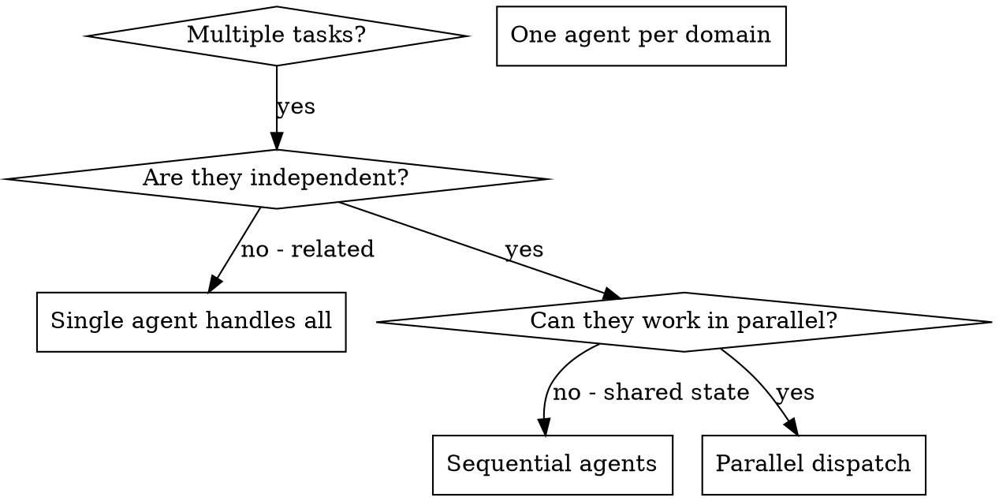

⚠️ HARD GATE: MAX 3 concurrent subagents ⚠️

# Dispatching Parallel Agents

## Overview

You delegate tasks to specialized agents with isolated context. By precisely crafting their instructions and context, you ensure they stay focused and succeed at their task. They should never inherit your session's context or history — you construct exactly what they need. This also preserves your own context for coordination work.

When you have multiple unrelated investigations or reviews (different subsystems, different files, different questions), running them sequentially wastes time. Each is independent and can happen in parallel.

**Core principle:** Dispatch one agent per independent domain. Let them work concurrently.

**Path resolution:** All `reads` paths in the template examples below are relative. They resolve against the subagent's working directory, which inherits from your current directory (`ctx.cwd`). If the target code lives in a different directory (e.g., a worktree), set `cwd: /path/to/target` on each subagent tool call to ensure paths resolve correctly. Alternatively, use absolute paths in `reads`.

## When to Use



**Use when:**

- 3+ independent investigation questions across different files
- Multiple subsystems need parallel reconnaissance
- Per-task review gates: spec reviewer + guardian dispatched together
- Each domain can be understood without context from others
- No shared state between investigations

**Don't use when:**

- Questions are related (one answer might inform another)
- Need to understand full system state before any investigation
- Agents would interfere with each other (same files, same resources)

## The Pattern

### 1. Identify Independent Domains

Group work by what's being investigated:

- Domain A: How does the editor module handle state?
- Domain B: What's the render pipeline's structure?
- Domain C: What testing patterns does the project use?

Each domain is independent — understanding the editor doesn't require render pipeline context.

### 2. Create Focused Agent Tasks

Each agent gets:

- **Specific scope:** Exact files to read, not vague areas
- **Clear goal:** Answer specific questions (scout) or review against specific criteria (reviewer)
- **Constraints:** Don't explore beyond listed files
- **Expected output:** Bullet list under 500 words (scout) or structured findings (reviewer)

**For scout tasks:** follow `../dispatching-parallel-agents/scout-prompt.md` — every scout MUST have:
- Specific files to read (not "the auth module")
- Specific questions to answer (2-4 numbered bullets)
- A stop boundary ("stop after reading listed files")
- A conciseness directive ("bullet list under 500 words")

**For review tasks:** dispatch spec reviewer and guardian in parallel per the
`parallel-review` skill. Each gets a prompt template with the task scope,
diff, and specific review criteria.

### 3. Dispatch in Parallel

Dispatch one agent per domain concurrently by issuing one `subagent(agent, task)` call per agent. Pi handles parallelism across multiple simultaneous tool calls automatically.

**Parallel investigation (scouts):**

```
subagent({ agent: "scout", task: "Read src/editor/state.ts and src/editor/reducer.ts. Answer: (1) How is editor state structured? (2) What actions mutate it? (3) Where are side effects triggered? Stop after these files. Bullet list under 400 words.", reads: ["src/editor/state.ts", "src/editor/reducer.ts"] })
subagent({ agent: "scout", task: "Read src/render/pipeline.ts and src/render/compositor.ts. Answer: (1) What are the render stages? (2) How are layers composited? (3) Where does the frame budget get allocated? Stop after these files. Bullet list under 400 words.", reads: ["src/render/pipeline.ts", "src/render/compositor.ts"] })
```

**Parallel review (spec + guardian):**

```
subagent({ agent: "reviewer", task: "Review spec compliance for Task 3. [full task text and diff]" })
subagent({ agent: "guardian", task: "Review code quality and project conventions for Task 3. [summary and diff]" })
```

### 4. Gather and Integrate

When agents return:

- Read each summary
- Cross-reference findings for conflicts or gaps
- Proceed with implementation or review decisions

## Agent Prompt Structure

Good agent prompts are:

1. **Focused** - One clear domain
2. **Self-contained** - All context needed to understand the problem
3. **Specific about output** - What should the agent return?

```markdown
Read src/agents/agent-tool-abort.test.ts and src/agents/abort-handler.ts.

Answer:
1. What are the 3 test names and their expected behavior?
2. What assertions are currently failing and why?
3. Is the abort handler missing a state transition the tests expect?

Stop after reading these two files. Bullet list under 400 words.
```

## Common Mistakes

**❌ Vague scout task:** "Investigate agent-tool-abort.test.ts failures" - scout wanders, reads 26 files
**✅ Bounded scout task:** "Read agent-tool-abort.test.ts and abort-handler.ts. Answer: (1) What are the test names? (2) What's failing? (3) What state is the handler missing? Stop after these files. Bullet list under 400 words."

**❌ Too broad:** "Review all the changes" - agent gets lost
**✅ Specific:** "Review spec compliance for Task 3 against the plan requirements"

**❌ No context:** "Review the code" - agent doesn't know what to check
**✅ Context:** Paste the task requirements, diff, and specific review criteria

**❌ No constraints:** Agent might explore everything
**✅ Constraints:** "Read only these files" or "Review only against these criteria"

**❌ Vague output:** "Tell me what you find" - you don't know what you'll get
**✅ Specific:** "Return structured findings with file:line references"

## When NOT to Use

**Related domains:** One investigation might answer questions for another — investigate together first
**Need full context:** Understanding requires seeing entire system
**Exploratory debugging:** You don't know what's broken yet
**Shared state:** Agents would interfere (editing same files, using same resources)

## Key Benefits

1. **Parallelization** - Multiple investigations happen simultaneously
2. **Focus** - Each agent has narrow scope, less context to track
3. **Independence** - Agents don't interfere with each other
4. **Speed** - 3 problems investigated in time of 1

## Verification

After agents return:

1. **Review each summary** - Understand what was found
2. **Check for conflicts** - Did agents reach contradictory conclusions?
3. **Cross-reference** - Do findings from different domains connect?
4. **Spot check** - Agents can make systematic errors; verify key claims
