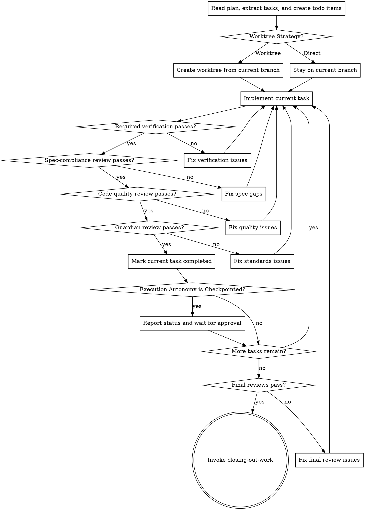

# Executing Plans

## Overview

Load plan, review critically, read the declared `Execution Autonomy`, execute tasks with required verification and review, report when complete.

**Announce at start:** "I'm using the executing-plans skill to implement this plan."

**Use this skill when:** the inline execution path has been chosen for the plan.

## Checklist

<IMPORTANT>
Create a task for each implementation task from the plan and complete them in order.

todo rules:

1. Create exactly one todo item per plan task.
2. Use the exact `Task N: ...` heading text from the plan as the todo content.
3. Replace any earlier planning or brainstorming checklist items when execution begins.
4. Keep exactly one task `in_progress` at a time.
5. Do not create extra todo items for verification, review gates, or manual checks.
6. Keep the current task `in_progress` until implementation, required verification, spec-compliance review, code-quality review, and guardian review all succeed.
7. If review requires more changes, move the same task back to `in_progress` instead of creating a new todo item.
8. Mark the task `completed` only after all required work for that task is finished.
9. In `Checkpointed` mode, wait for user approval only after marking the current task `completed`.
   </IMPORTANT>

## Process Flow



## The Process

### Step 1: Load and Review Plan

1. Read plan file
2. Read the plan's declared `Execution Autonomy` and `Worktree Strategy`
3. Review critically - identify any questions or concerns about the plan
4. If concerns: Raise them with your human partner before starting
5. If no concerns: Create todo items from the exact plan task headings and proceed

### Step 1.5: Set Up Work Environment

Read the plan's declared `Worktree Strategy` and follow it exactly.

#### If `Worktree Strategy: Worktree`

Create a git worktree from the **current branch** to isolate work:

```bash
# 1. Note where you are
CURRENT_BRANCH=$(git branch --show-current)
REPO_ROOT=$(git rev-parse --show-toplevel)

# 2. Check the working tree is clean
git status --porcelain
# If dirty: "Working tree has uncommitted changes. Commit them first (outside this workflow) or abort?"

# 3. Derive a branch name from the plan
#    e.g. plan title "Add Auth Refactor" → branch: "feature-auth-refactor"
#    Sanitize: lowercase, hyphens, no special chars
#    The worktree directory is named the same as the branch for simplicity

# 4. Create the worktree from the current branch
git worktree add ../<branch-name> -b <branch-name> $CURRENT_BRANCH

# 5. Work from the worktree
cd ../<branch-name>
```

The agent now works entirely inside the worktree. Tests and file edits happen there.
Git write operations (commit, push, merge) are not performed during execution — they are
gated behind user review at checkpoints (if `Execution Autonomy: Checkpointed`) and at
close-out via closing-out-work.

**If a worktree for this branch already exists**, `cd` into it instead of creating a new one.

#### If `Worktree Strategy: Direct`

Work directly on the current branch. No worktree setup needed.

#### If the repo can't support worktrees (bare repo, submodule)

Fall back to working on the current branch regardless of the plan's Worktree Strategy.

Before executing tasks, read `Execution Autonomy` from the plan.

- `Fully autonomous`: continue task-to-task unless a stop condition interrupts execution.
- `Checkpointed`: after each completed task, report status and wait for user approval before continuing.

In both autonomy modes, a task is complete only after its required verification, spec-compliance review, code-quality review, and guardian review succeed.

The spec-compliance review, code-quality review, and guardian review are separate mandatory gates for every task in inline execution.

If any review leads to code changes, re-run the task's required verification on the updated code, then re-run all three review gates before marking the task complete.

For each task:

1. Mark the matching todo item as `in_progress`
2. Follow each step exactly (plan has bite-sized steps)
3. Run verifications as specified
4. Re-read the current task and confirm the implementation matches the task and plan without adding unrequested behavior. This is the mandatory spec-compliance review gate.
5. Run a distinct code-quality review of the changed work before proceeding. This review is mandatory for every task. For risky, behavior-changing, or multi-file tasks, use know-how:requesting-code-review for a focused review.
6. Run a guardian review of the changed work. This review checks adherence to documented project conventions (AGENTS.md, project skill, pi-memory, reflections). Optimization suggestions are handled by the maester at close-out — they do not block task completion. This review is mandatory for every task.
7. If any review changes code, re-run the task's required verification and all three review gates on the updated state
8. Mark the same todo item as `completed`
9. If `Execution Autonomy` is `Checkpointed`, report status and wait for user approval before starting the next task

### Step 3: Complete Development

After all tasks complete and verified:

- Run final reviews in parallel: whole-implementation reviewer (comprehensive sweep) and maester (process optimization + memory stewardship + optimization synthesis). Both must approve before closing out.
- If either final review requires code changes, re-run the relevant verification and review on the updated code before continuing
- Announce: "All implementation tasks complete. Executing close-out task."
- The plan's close-out task handles verification, maester optimization synthesis, cleanup, and integration.

## When to Stop and Ask for Help

**STOP executing immediately when:**

- Hit a blocker (missing dependency, test fails, instruction unclear)
- Plan has critical gaps preventing starting
- You don't understand an instruction
- Verification fails repeatedly
- Required context is missing
- The user interrupts or redirects the work

**Ask for clarification rather than guessing.**

## When to Revisit Earlier Steps

**Return to Review (Step 1) when:**

- Partner updates the plan based on your feedback
- Fundamental approach needs rethinking

**Don't force through blockers** - stop and ask.

## Remember

- Review plan critically first
- Read and follow the plan's `Execution Autonomy` exactly
- Read and follow the plan's `Worktree Strategy` exactly
- Create todo items from the exact plan task headings only
- Follow plan steps exactly
- Follow the plan's `Testing Approach` exactly
- Don't skip verifications
- Don't create extra todo items for verification, review gates, or manual checks
- Don't mark a task complete before spec-compliance review, code-quality review, and guardian review
- If review changes code, re-run verification and re-review before completion
- Don't skip the final parallel reviews (whole-implementation + maester) before the close-out task
- Reference skills when plan says to
- Stop when blocked, don't guess
- Never start implementation on main/master branch without explicit user consent
- Never make git write operations during execution — no commits, pushes, merges, stash, checkout --, branch -D, or worktree remove during task execution. All git integration is gated behind user review at checkpoints and at close-out via closing-out-work
- Never treat worktree branches as “safe to commit on” — the git write gate applies universally, regardless of branch
- Use the current workspace unless the user explicitly asks for a different setup

## Integration

**Required workflow skills:**

- **know-how:writing-plans** - Creates the plan this skill executes
- **know-how:requesting-code-review** - Use for focused code review on risky, behavior-changing, or multi-file tasks
- **know-how:closing-out-work** - Close out work after all tasks, get user review, then choose integration (invoked by the plan's close-out task)
