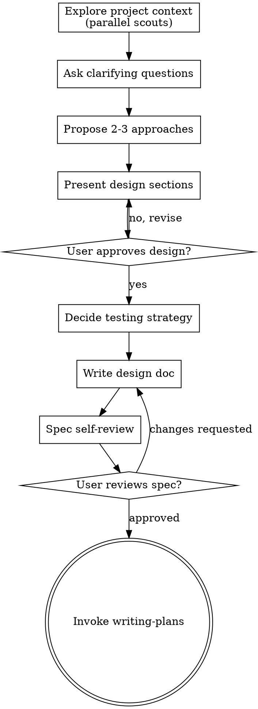

# Planning Ideas Into Designs

Help turn ideas into an approved design and a written spec before implementation.

Do not invoke implementation skills, write code, scaffold projects, or make behavior changes until you have presented a design and the user has approved it.

## Checklist

<IMPORTANT>
Create a task for each of these items and complete them in order:

1. **Explore project context** — dispatch parallel `scout` agents with bounded tasks (see `./dispatching-parallel-agents/scout-prompt.md`). Each scout gets: specific files to read, specific questions to answer, a stop boundary, and a conciseness directive. Gather all results before continuing. Never dispatch a scout with a vague mandate like "explore the codebase."
2. **Ask clarifying questions** — one at a time, focused on purpose and constraints
3. **Propose 2-3 approaches** — include trade-offs and a recommendation
4. **Present the design** — scale detail to complexity, get approval section by section
5. **Decide the testing strategy** — identify critical behaviors, manual checks, and whether the work should use TDD or be manually tested
6. **Write the design doc** — call `present_choice` to ask whether the user
   wants a full HTML spec or a markdown spec saved in the specs folder. State
   the trade-offs neutrally — do not recommend either option. Then follow the
   documentation rules below for the chosen format and present the resulting
   path or link to the user.
7. **Self-review the spec** — remove ambiguity, placeholders, and contradictions
8. **Ask the user to review the spec** — wait for approval before moving on
9. **Set the session goal** — call `set_session_goal` with the spec title as a complete sentence (but no punctuation or emojis) under 8 words.
10. **Transition to implementation planning** — if the controller is still in read mode,
   use the shared write-mode approval prompt before continuing (the plan will be
   written to disk). Then invoke `know-how:writing-plans`.
<IMPORTANT>

## Process Flow

The terminal state is invoking `know-how:writing-plans`.

## The Process

**If the user has not specified what they want to plan yet** 
- Just ask them "What would you like to plan?" and wait for their response. 
- Don't make any tool calls
- Don't make a todo list yet
- Just ask and wait for their answer. Then follow the process flow from there.

**Understanding the idea:**

- **Explore the current project state first using parallel `scout` agents.** Identify independent read domains (e.g., "the editor module," "the render pipeline," "test coverage") and dispatch one `scout` per domain. Each scout task MUST include: exact files to read, 2-4 specific questions to answer, a stop boundary ("stop after reading listed files"), and a conciseness directive ("bullet list under 500 words"). Issue one `subagent(agent, task)` call per scout — pi runs them in parallel automatically. See `./dispatching-parallel-agents/scout-prompt.md` for the full template. Never dispatch a scout without these four elements — unbounded scouts burn tokens without producing useful results. Gather all results before drawing conclusions or asking questions
- If the request covers multiple independent subsystems, decompose it before refining details
- Ask one question at a time
- Use the `present_choice` tool for all questions and approval gates — never ask the user to type a response `present_choice` auto-adds `Something else...`; do not add a duplicate. `otherLabel` renames it, so keep it short
- Focus on purpose, constraints, and success criteria

⚠️ HARD GATE: MAX 3 concurrent subagents ⚠️

**Exploring approaches:**

- Always propose 2-3 approaches
- Lead with your recommendation and explain why
- Surface trade-offs honestly

**Presenting the design:**

- Cover architecture, components, data flow, error handling, and testing
- Keep sections short when the problem is simple
- Ask for approval as you go

**Deciding the testing strategy:**

- Decide whether TDD should be required or manual only
- Identify the highest-risk behavior worth automated coverage
- Call out visual or cosmetic changes that should be verified manually instead
- Avoid designs that imply every UI detail needs an automated assertion

**Working in existing codebases:**

- Follow the existing structure unless it directly blocks the work
- Include targeted cleanup only when it serves the design
- Avoid unrelated refactors

## After the Design

**Documentation:**

- Always call `present_choice` to offer a full HTML spec or a markdown spec.
  State the trade-offs neutrally — do not recommend either option.
- If the user chooses HTML, dispatch the `deckbuilder` agent with the validated
  spec as a JSON payload. If the controller is still in read mode, the
  write-capable gate will surface write-mode approval automatically before
  deckbuilder starts. (see `deckbuilder-prompt.md` for format) Use output path
  `~/.know-how/<project-name>/specs/YYYY-MM-DD-<topic>.html`.
  The deckbuilder writes the HTML file and returns a `file://` link.
  > **Important:** Present it as a short markdown link label like `[Open spec](file://...)`, never a bare `file://...` URL.
  > **Important:** Dispatch the deckbuilder **exactly once** per spec. Just make any
  > subsequent changes during self-review (step 7) or user review (step 8) inline.
- If the user chooses markdown, write the validated spec directly to
  `~/.know-how/<project-name>/specs/YYYY-MM-DD-<topic>.md` and present the path
  to the user.
- Derive `<project-name>` from the git repository root (`git rev-parse --show-toplevel`)
  basename, lowercased with non-alphanumeric runs replaced by hyphens.
- If `~/.know-how/<project-name>/` does not exist, use `present_choice` to
  offer: create it, use another path, or skip (write the spec inline to the
  current context).
- User preferences for spec location override this default.
- Include a short testing strategy section so planning starts from an explicit
  decision.

**Spec Self-Review:**

1. Placeholder scan: remove `TBD`, `TODO`, and vague requirements
2. Internal consistency: ensure sections do not contradict each other
3. Scope check: confirm the scope can be executed as one coherent plan without mixing unrelated subsystems or independent deliverables
4. Ambiguity check: make edge-case behavior explicit for any case that changes user-visible behavior, validation, failure handling, or state transitions

Fix self-review issues inline. For HTML specs, edit the generated file
directly with `bash sed` or `edit` — do not re-dispatch the deckbuilder.
If a fix changes the design materially, present the updated spec to the
user before planning.

**User Review Gate:**

After the self-review passes, ask the user to review the written spec before planning.

> "Spec written to `<path>`. Please review it and let me know if you want any changes before we write the implementation plan."

If the user requests changes to an HTML spec, edit the generated file
directly — do not re-dispatch the deckbuilder.

Wait for approval before invoking the next skill.

### Set the session goal

After the user approves the spec and before transitioning to implementation
planning, call `set_session_goal` with the spec title as a complete sentence
under 8 words describing the work (e.g. "Refactor room editor" or
"Create current goal widget"). This displays the goal in the editor's bottom
border for the duration of the session.

## Key Principles

- One question at a time
- Multiple choice preferred when useful
- YAGNI aggressively
- Explore alternatives before settling
- Get explicit approval before implementation
