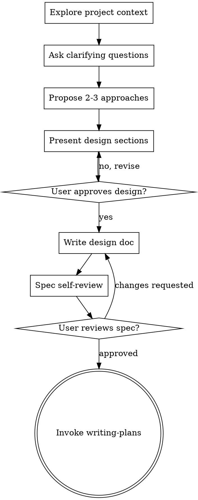

# Brainstorming Ideas Into Designs

Help turn rough ideas into an approved design and a written spec before implementation.

<HARD-GATE>
Do NOT invoke implementation skills, write code, scaffold projects, or make behavior changes until you have presented a design and the user has approved it.
</HARD-GATE>

## Checklist

You MUST create a task for each of these items and complete them in order:

1. **Explore project context** — check files, docs, and recent history
2. **Ask clarifying questions** — one at a time, focused on purpose and constraints
3. **Propose 2-3 approaches** — include trade-offs and a recommendation
4. **Present the design** — scale detail to complexity, get approval section by section
5. **Write the design doc** — save to `docs/know-how/specs/YYYY-MM-DD-<topic>-design.md`
6. **Self-review the spec** — remove ambiguity, placeholders, and contradictions
7. **Ask the user to review the spec** — wait for approval before moving on
8. **Transition to implementation planning** — invoke `know-how:writing-plans`

## Process Flow

The terminal state is invoking `know-how:writing-plans`.

## The Process

**Understanding the idea:**

- Explore the current project state first
- If the request covers multiple independent subsystems, decompose it before refining details
- Ask one question per message
- Prefer multiple choice when it makes the trade-off clearer
- Focus on purpose, constraints, and success criteria

**Exploring approaches:**

- Always propose 2-3 approaches
- Lead with your recommendation and explain why
- Surface trade-offs honestly

**Presenting the design:**

- Cover architecture, components, data flow, error handling, and testing
- Keep sections short when the problem is simple
- Ask for approval as you go

**Working in existing codebases:**

- Follow the existing structure unless it directly blocks the work
- Include targeted cleanup only when it serves the design
- Avoid unrelated refactors

## After the Design

**Documentation:**

- Write the validated spec to `docs/know-how/specs/YYYY-MM-DD-<topic>-design.md`
- User preferences for spec location override this default

**Spec Self-Review:**

1. Placeholder scan: remove `TBD`, `TODO`, and vague requirements
2. Internal consistency: ensure sections do not contradict each other
3. Scope check: confirm it is focused enough for one implementation plan
4. Ambiguity check: make edge-case behavior explicit where needed

Fix issues inline and move on.

**User Review Gate:**

After the self-review passes, ask the user to review the written spec before planning.

> "Spec written to `<path>`. Please review it and let me know if you want any changes before we write the implementation plan."

Wait for approval before invoking the next skill.

## Key Principles

- One question at a time
- Multiple choice preferred when useful
- YAGNI aggressively
- Explore alternatives before settling
- Get explicit approval before implementation
