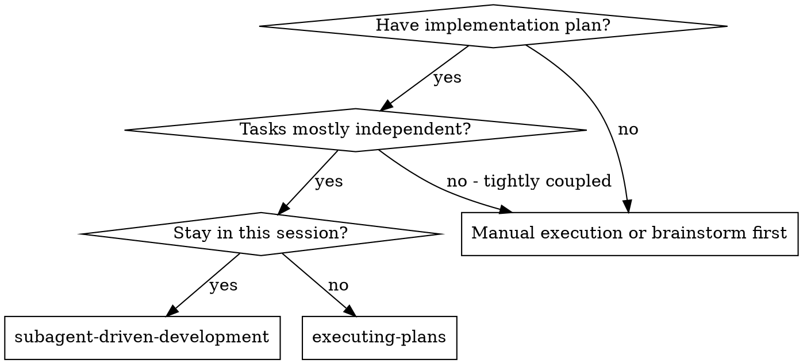
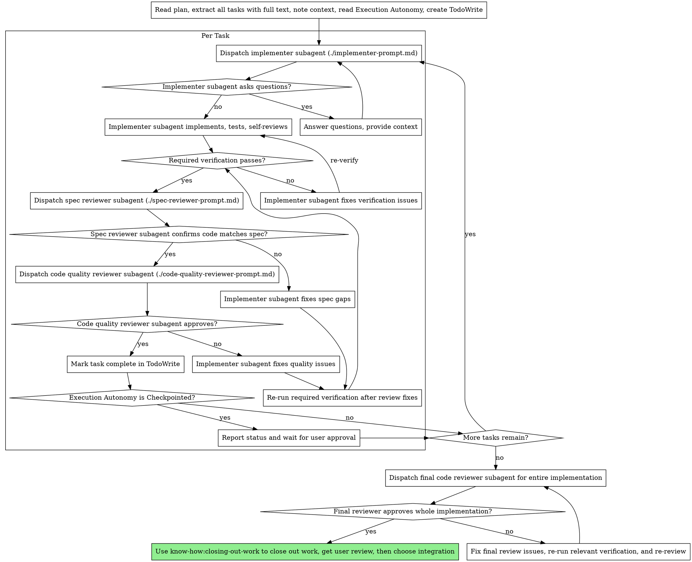

# Subagent-Driven Development

Execute plan by dispatching fresh subagent per task, with required verification plus two-stage review after each: spec compliance review first, then code quality review. Follow the plan's declared `Execution Autonomy` exactly.

**Why subagents:** You delegate tasks to specialized agents with isolated context. By precisely crafting their instructions and context, you ensure they stay focused and succeed at their task. They should never inherit your session's context or history — you construct exactly what they need. This also preserves your own context for coordination work.

**Core principle:** Fresh subagent per task + required verification + two-stage review (spec then quality) + strict plan-contract enforcement = high quality, predictable execution

## When to Use



**vs. Executing Plans:**
- Same session (no context switch)
- Fresh subagent per task (no context pollution)
- Two-stage review after each task: spec compliance first, then code quality
- Follows the plan's declared `Execution Autonomy` exactly

## The Process



## Execution Autonomy

Before dispatching Task 1, read the plan's `Execution Autonomy` field.

- `Fully autonomous`: after a task clears required verification, spec review, and code-quality review, mark it complete and continue to the next task.
- `Checkpointed`: after a task clears required verification, spec review, and code-quality review, mark it complete, report status, and wait for user approval before starting the next task.

These approval pauses happen after the task's required review and verification work is complete. They do not replace the review gates.

If either review requires code changes, re-run the task's required verification on the updated code before sending it back through review.

## Model Selection

Use the least powerful model that can handle each role to conserve cost and increase speed.

**Mechanical implementation tasks** (isolated functions, clear specs, 1-2 files): use a fast, cheap model. Most implementation tasks are mechanical when the plan is well-specified.

**Integration and judgment tasks** (multi-file coordination, pattern matching, debugging): use a standard model.

**Architecture, design, and review tasks**: use the most capable available model.

**Task complexity signals:**
- Touches 1-2 files with a complete spec → cheap model
- Touches multiple files with integration concerns → standard model
- Requires design judgment or broad codebase understanding → most capable model

## Handling Implementer Status

Implementer subagents report one of four statuses. Handle each appropriately:

**DONE:** Confirm the task's required verification passed, then proceed to spec compliance review.

**DONE_WITH_CONCERNS:** The implementer completed the work but flagged doubts. Read the concerns before proceeding. If the concerns are about correctness or scope, address them before review. If they're observations (e.g., "this file is getting large"), note them and proceed only after the task's required verification has passed.

**NEEDS_CONTEXT:** Treat this as a stop condition for the current run. Surface the missing context to your human partner and wait. Resume only after the human provides the missing context or updates the plan.

**BLOCKED:** Treat this as a stop condition for the current run. Surface the blocker to your human partner and wait. If the human wants work to continue, first get the missing decision, updated plan, or revised scope, then resume from that updated context.

**Never** ignore an escalation or force the same model to retry without changes. If the implementer said it's stuck, something needs to change before execution resumes.

## Prompt Templates

- `./implementer-prompt.md` - Dispatch implementer subagent
- `./spec-reviewer-prompt.md` - Dispatch spec compliance reviewer subagent
- `./code-quality-reviewer-prompt.md` - Dispatch code quality reviewer subagent

## Example Workflow

```
You: I'm using Subagent-Driven Development to execute this plan.

[Read plan file once: ~/.config/opencode/projects/know-how/<project-name>/plans/feature-plan.md]
[Read `Execution Autonomy` from the plan]
[Extract all 5 tasks with full text and context]
[Create TodoWrite with all tasks]

Task 1: Hook installation script

[Get Task 1 text and context (already extracted)]
[Dispatch implementation subagent with full task text + context]

Implementer: "Before I begin - should the hook be installed at user or system level?"

You: "User level (~/.config/opencode/hooks/)"

Implementer: "Got it. Implementing now..."
[Later] Implementer:
  - Implemented install-hook command
  - Added tests, 5/5 passing
  - Self-review: Found I missed --force flag, added it

[Confirm required task verification passed]
[Dispatch spec compliance reviewer]
Spec reviewer: ✅ Spec compliant - all listed requirements implemented, no unrequested behavior or options added

[Get git SHAs, dispatch code quality reviewer]
Code reviewer: Strengths: Good test coverage, clean. Issues: None. Approved.

[Mark Task 1 complete]
[If `Execution Autonomy` is `Checkpointed`, report status and wait for user approval]

Task 2: Recovery modes

[Get Task 2 text and context (already extracted)]
[Dispatch implementation subagent with full task text + context]

Implementer: [No questions, proceeds]
Implementer:
  - Added verify/repair modes
  - 8/8 tests passing
  - Self-review: No additional issues found in this pass

[Dispatch spec compliance reviewer]
Spec reviewer: ❌ Issues:
  - Missing: Progress reporting (spec says "report every 100 items")
  - Extra: Added --json flag (not requested)

[Implementer fixes issues]
Implementer: Removed --json flag, added progress reporting

[Spec reviewer reviews again]
Spec reviewer: ✅ Spec compliant now

[Dispatch code quality reviewer]
Code reviewer: Strengths: Solid. Issues (Important): Magic number (100)

[Implementer fixes]
Implementer: Extracted PROGRESS_INTERVAL constant

[Code reviewer reviews again]
Code reviewer: ✅ Approved

[Mark Task 2 complete]

...

[After all tasks]
[Dispatch final code-reviewer]
Final reviewer: Spec requirements satisfied, no blocking code-quality issues found. Use know-how:closing-out-work before merge.

[If final reviewer finds blocking issues, fix them, re-run relevant verification, and re-review before closing out]

Done!
```

## Advantages

**vs. Manual execution:**
- Subagents follow the plan's testing strategy consistently
- Fresh context per task (no confusion)
- Parallel-safe (subagents don't interfere)
- Subagent can ask questions (before AND during work)

**vs. Executing Plans:**
- Same session (no handoff)
- Same autonomy contract, but with fresh subagent context per task
- Review checkpoints automatic

**Efficiency gains:**
- No file reading overhead (controller provides full text)
- Controller curates exactly what context is needed
- Subagent gets complete information upfront
- Questions surfaced before work begins (not after)

**Quality gates:**
- Required verification before review and completion
- Self-review catches issues before handoff
- Two-stage review: spec compliance, then code quality
- Review loops ensure fixes actually work
- Final whole-implementation review before closing out work
- Spec compliance prevents over/under-building
- Code quality ensures implementation is well-built
- `Checkpointed` mode adds user approval after each completed task

**Cost:**
- More subagent invocations (implementer + 2 reviewers per task)
- Controller does more prep work (extracting all tasks upfront)
- Review loops add iterations
- But catches issues early (cheaper than debugging later)

## Red Flags

**Never:**
- Start implementation on main/master branch without explicit user consent
- Skip reviews (spec compliance OR code quality)
- Proceed with unfixed issues
- Dispatch multiple implementation subagents in parallel (conflicts)
- Make subagent read plan file (provide full text instead)
- Skip scene-setting context (subagent needs to understand where task fits)
- Ignore subagent questions (answer before letting them proceed)
- Accept "close enough" on spec compliance (spec reviewer found issues = not done)
- Skip review loops (reviewer found issues = implementer fixes = review again)
- Let implementer self-review replace actual review (both are needed)
- **Start code quality review before spec compliance is ✅** (wrong order)
- Move to next task while either review has open issues
- Ignore the plan's declared `Execution Autonomy`
- Continue to the next task in `Checkpointed` mode without user approval
- Treat `NEEDS_CONTEXT` or `BLOCKED` as permission to keep going without your human partner

**If subagent asks questions:**
- Answer clearly and completely
- Provide additional context if needed
- Don't rush them into implementation

**If reviewer finds issues:**
- Implementer (same subagent) fixes them
- Re-run the task's required verification on the updated code
- Reviewer reviews again
- Repeat until approved
- Don't skip the re-review

**After the final whole-implementation review:**
- if blocking issues are found, fix them
- re-run the relevant verification on the updated code
- send the whole implementation back for final review
- do not move to `closing-out-work` until the final reviewer approves

**In both autonomy modes:**
- do not continue past blockers, missing context, repeated verification failure, a critical plan gap or inconsistency, or user interruption
- do not treat autonomy mode as permission to skip reviews or verification

**If subagent fails task:**
- Dispatch fix subagent with specific instructions
- Don't try to fix manually (context pollution)

## Integration

**Required workflow skills:**
- **know-how:writing-plans** - Creates the plan this skill executes
- **know-how:requesting-code-review** - Code review template for reviewer subagents
- **know-how:closing-out-work** - Close out work after all tasks, get user review, then choose integration

**Subagents should use:**
- **know-how:test-driven-development** - Use when the plan's `Testing Approach` says `TDD Decision: Required`

**Alternative workflow:**
- **know-how:executing-plans** - Use for inline execution instead of fresh subagent-per-task execution
