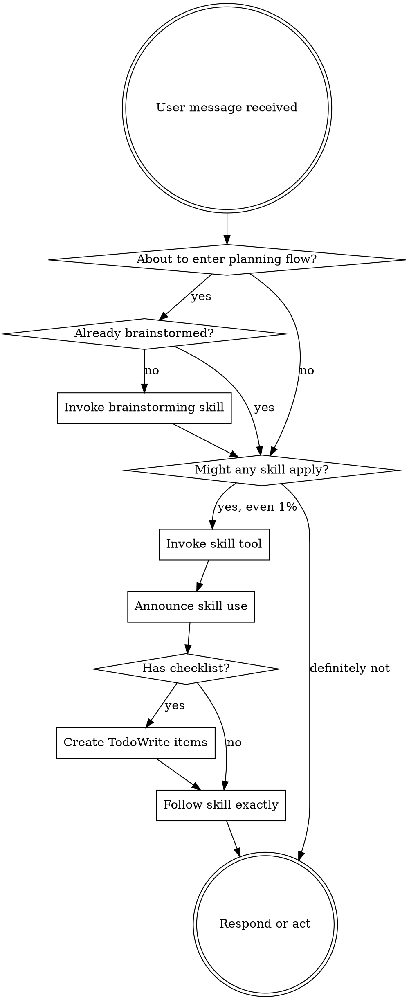

<SUBAGENT-STOP>
If you were dispatched as a subagent to execute a specific task, skip this skill.
</SUBAGENT-STOP>

<EXTREMELY-IMPORTANT>
If there is even a 1% chance that a skill applies, invoke it before responding or acting.

If a skill applies to the task, you must use it.
</EXTREMELY-IMPORTANT>

## Instruction Priority

Know-how skills override default behavior, but **user instructions always take precedence**:

1. **User instructions and project guidance** (`AGENTS.md`, repo docs, direct requests)
2. **Know-how skills**
3. **Default system behavior**

If project guidance conflicts with a skill, follow the project guidance.
## Verification Rule

When a task affects a specific repo, do not claim completion until the workspace guidance checks are done.

## How to Access Skills

Use OpenCode's `skill` tool. When you invoke a skill, its content is loaded for you to follow directly.

Do not read skill files directly unless the user specifically asks for file contents.

## The Rule

**Invoke relevant or requested skills before any response or action.** If the loaded skill turns out not to apply, you can stop using it. The check still has to happen first.

## Red Flags

These thoughts mean stop and check for skills first:

| Thought | Reality |
|---------|---------|
| "This is just a simple question" | Questions are tasks. Check for skills. |
| "I need more context first" | Skill check comes before clarifying questions. |
| "Let me explore the codebase first" | Skills tell you how to explore. |
| "I remember this skill already" | Skills change. Load the current version. |
| "I'll just do one thing first" | The skill check happens before action. |
| "The skill is overkill" | Small tasks are where process gets skipped. |

## Skill Priority

When multiple skills could apply, use this order:

1. **Process skills first**: brainstorming, debugging, planning
2. **Execution skills second**: implementation or review workflows
3. **Reference skills last**: supporting techniques and examples

## Skill Types

**Rigid skills**: follow exactly. These usually enforce discipline.

**Flexible skills**: adapt the guidance to the codebase and task.

If a skill does not explicitly label itself, infer the type from its language:
- hard gates, no-exception rules, and mandatory ordered steps usually mean rigid
- adaptable guidance, codebase-sensitive wording, and explicit judgment calls usually mean flexible
